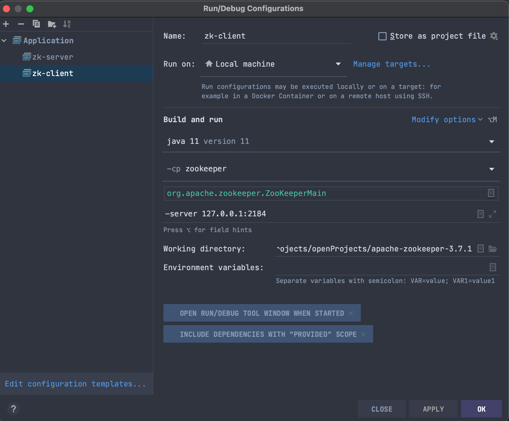
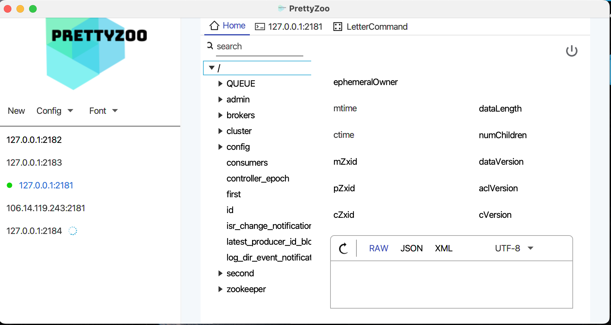
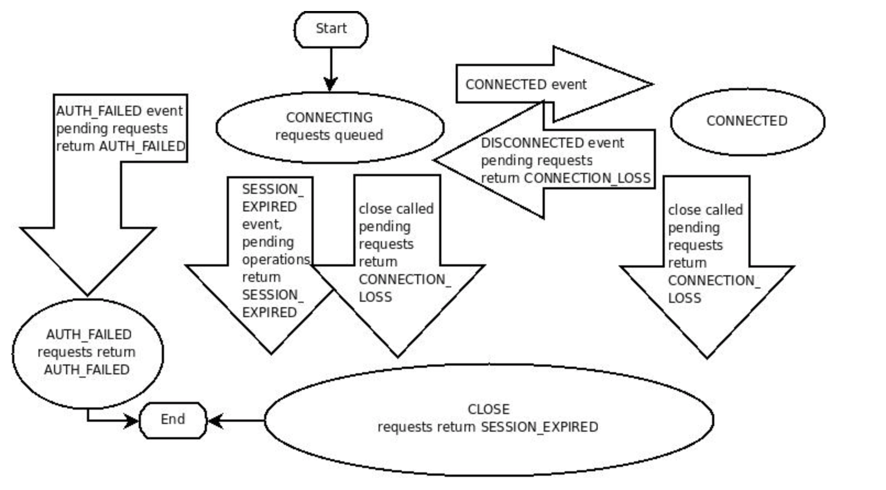
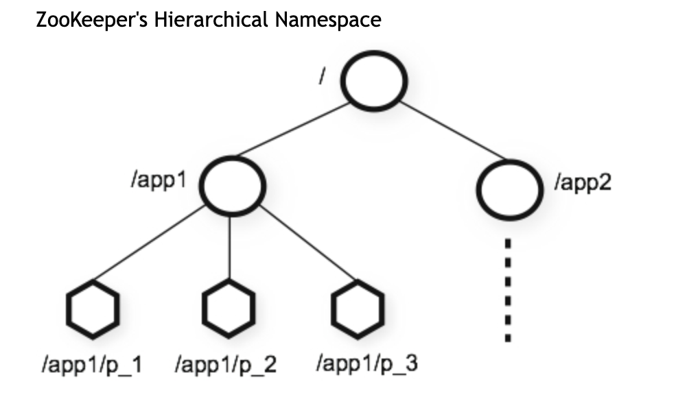
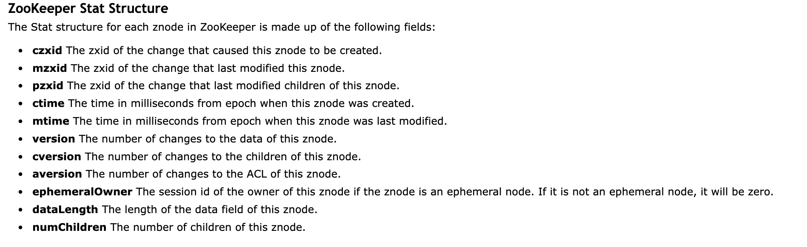
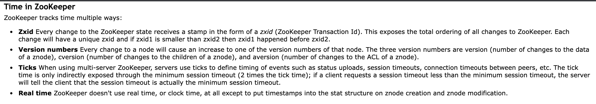

<div align='center'><span style="font-size: large; "><b>zookeeper</b></span></div>

## 简 介

### 介绍

- 官网地址：https://zookeeper.apache.org/

```text
  ZooKeeper is a centralized service for maintaining configuration information, naming, providing distributed synchronization, 
  and providing group services. All of these kinds of services are used in some form or another by distributed applications. 
  Each time they are implemented there is a lot of work that goes into fixing the bugs and race conditions that are inevitable. 
  Because of the difficulty of implementing these kinds of services, applications initially usually skimp on them, which make 
  them brittle in the presence of change and difficult to manage. Even when done correctly, different implementations of these 
  services lead to management complexity when the applications are deployed.
```

- wiki: https://zh.wikipedia.org/wiki/Apache_ZooKeeper

```text
    Apache ZooKeeper是Apache软件基金会的一个软件项目，它为大型分布式计算提供开源的分布式配置服务、同步服务和命名注册。ZooKeeper曾经是
    Hadoop的一个子项目，但现在是一个独立的顶级项目。ZooKeeper的架构通过冗余服务实现高可用性。因此，如果第一次无应答，客户端就可以询问另一台ZooKeeper主机。
    ZooKeeper节点将它们的数据存储于一个分层的名字空间，非常类似于一个文件系统或一个前缀树结构。客户端可以在节点读写，从而以这种方式拥有一个共享的配置服务。
    更新是全序的。使用ZooKeeper的公司包括Rackspace、雅虎[2]和eBay，以及类似于像Solr这样的开源企业级搜索系统。
```

### 经典用途

- Naming service
- Configuration management
- Data Synchronization
- Leader election
- Message queue
- Notification system

## 单机安装

### 物理安装

前置条件：centOS7.X java8以上

```shell
wget https://www.apache.org/dyn/closer.lua/zookeeper/zookeeper-3.7.1/apache-zookeeper-3.7.1-bin.tar.gz
tar -zxvf apache-zookeeper-3.7.1-bin.tar.gz -C /usr/local
cd /usr/local/apache-zookeeper-3.7.1-bin/conf
cp zoo_sample.cfg zoo.cfg
cd /usr/local/apache-zookeeper-3.7.1-bin/bin
./zkServer.sh help # Usage: ./zkServer.sh [--config <conf-dir>] {start|start-foreground|stop|version|restart|status|print-cmd}
zkServer.sh start # 启动
zkServer.sh start-foreground # 前端启动
zkServer.sh status # 查看状态
zkServer.sh stop # 停止
```

### docker安装

```shell
docker pull zookeeper:3.7.1
docker run -d --name zk-server -p 2281:2181 zookeeper:3.7.1
docker ps
lsof -i:2281
```

### 源码启动

```shell
git clone git clone https://github.com/apache/zookeeper.git # 下3.7.1版本
mvn clean install -DskipTests
```

用idea打开，conf下新建zoo.cfg zookeeper-server 包下的resources目录设置成配置源文件目录 zookeeper-server 引入slf4j包

```xml

<dependency>
    <groupId>org.slf4j</groupId>
    <artifactId>slf4j-simple</artifactId>
    <version>1.7.25</version>
    <scope>compile</scope>
</dependency>
```

启动类配置: Build and run -> Modify options -> 勾选 INCLUDE DEPENDENCIES WITH "PROVIDED" SCOPE -> 其他配置 -> run

## 客户端链接

### centOS7.X

```shell
cd ../zookeeper/bin # 可以配置环境变量
./zkCli.sh # 默认链接本机的2181 端口
./zkCli.sh -server 127.0.0.1:2181 # 指定 server 链接
```

### 代码链接

- 通过zkCli.cmd 找到客户端入口：org.apache.zookeeper.ZooKeeperMain
- 配置客户端启动类 如下图
  

- run 在控制台输命令

### prettyZoo

- github: https://github.com/vran-dev/PrettyZoo.git
- mac下载: [download-mac](https://github.com/vran-dev/PrettyZoo/releases/download/v1.9.7/prettyZoo-mac.dmg)
- window下载: [download-win](https://github.com/vran-dev/PrettyZoo/releases/download/v1.9.7/prettyZoo-win.msi)
- 界面  
  

## session

```text
A ZooKeeper client establishes a session with the ZooKeeper service by creating a handle to the service using a language binding.
Once created, the handle starts off in the CONNECTING state and the client library tries to connect to one of the servers that 
make up the ZooKeeper service at which point it switches to the CONNECTED state. During normal operation the client handle will 
be in one of these two states. If an unrecoverable error occurs, such as session expiration or authentication failure, or if the 
application explicitly closes the handle, the handle will move to the CLOSED state. The following figure shows the possible state
transitions of a ZooKeeper client:
```



## 数据模型和基本操作

### 数据模型

- [官网](https://zookeeper.apache.org/doc/current/zookeeperOver.html#sc_dataModelNameSpace)
  

### 基本操作

- 如下shell
  ```shell
  
  help # 查看帮助
    
  # 创建节点
  create /epoch
  create /epoch/angry_beard
  create /epoch/thorn
  
  # 创建节点并在节点上存数据
  create /epoch/angry_beard/hobby eat
  create /epoch/angry_beard/income 100
  
  # 获取ZNode
  ls /
  ls /epoch
  ls -R /epoch
  
  # 查询ZNode的值
  get /epoch/angry_beard
  get /epoch/angry_beard/hobby
  get /epoch/angry_beard/income
  
  # 修改ZNode的值
  set /epoch/angry_beard/income 200
  
  # 删除节点 存在子不能直接删除
  delete /epoch/angry_beard
  deleteall /epoch
  
  ```

- 节点状态

  [官方介绍](https://zookeeper.apache.org/doc/current/zookeeperProgrammers.html#sc_zkStatStructure)
  

    - 时间相关
        - ctime: (创建时间)The time in milliseconds from epoch when this z_node was created.
        - mtime: (最后修改时间)The time in milliseconds from epoch when this z_node was last modified.
    - 计量相关
        - numChildren   :(子节点数量)The number of children of this z_node.
        - dataLength    :(节点的长度)The length of the data field of this z_node.
        - ephemeralOwner:(是否临时节点，是则值为sessionId)The session id of the owner of this z_node if the z_node is an ephemeral
          node. If it is not an ephemeral node, it will be zero.
    - 版本相关
        - version : (当前节点被修改次数)The number of changes to the data of this z_node.
          ```shell
            set -v 2 /epoch/angry_beard/income 300
            set -v 1 /epoch/angry_beard/income 500
            stat /epoch/angry_beard/income
          ```
        - cversion: (子节点版本号)The number of changes to the children of this z_node.
          ```shell 
            create /epoch/angry_beard/home
            stat /epoch/angry_beard
            create /epoch/angry_beard/work
            stat /epoch/angry_beard
          ```
        - aversion: (ACL的版本号)The number of changes to the ACL of this z_node.
    - zxid
        - [官网](https://zookeeper.apache.org/doc/current/zookeeperProgrammers.html#sc_timeInZk)
          
          zxid是事物编号，8字节的整型数，即64个比特位，前32标识，后32位用来计算数。<br/>
          zxid的初始值为0: 00000000 00000000 00000000 00000000 00000000 00000000 00000000 00000000 <br/>
          每一次事务请求都会把后面的32位+1,比如进行了10次请求:00000000 00000000 00000000 00000000 00000000 00000000 00000000 00001010 <br/>
          每进行一次leader选举前32位+1，后32位清零：00000000 00000000 00000000 00000001 00000000 00000000 00000000 00000000 <br/>
          若一直没有进行leader选举，同时一直发生事务操作，极限值为: 00000000 00000000 00000000 00000000 11111111 11111111 11111111 11111111 <br/>
          此时再发生事务操作则前32位+1 变成：00000000 00000000 00000000 00000001 00000000 00000000 00000000 00000000 <br/>
            - czxid:当前节点被创建时的事务id
            - mzxid:当前节点最后一次被修改时的事务id
            - pzxid:当前节点的子节点最后一次被修改时的事务id，只有子节点变化才会改便pzid,子节点值变化不会改变pzid
          ```shell 
            create /zk-zxid
            stat /zk-zxid
            stat /zk-zxid
            create /zk-zxid/child01
            stat /zk-zxid
            stat /zk-zxid/child01
            set zk-zxid/child01 666
            stat zk-zxid
            create /zk-zxid/child02
            stat zk-zxid
          ```

## 节点特性

### 持久节点 （persistent）

- 特性: 不会因客户端宕机而删除节点

```shell
create # 查看create命令 : create [-s] [-e] [-c] [-t ttl] path [data] [acl]
create /angry_beard happy
stat /angry_beard # ephemeralOwner = 0x0
quit 
./zkCli.sh
ls /
```

### 临时节点 （ephemeral）

- 特性: 会因客户端宕机而删除节点

```shell
create -e /temp_node_test 666
stat /temp_node_test # ephemeralOwner = 0x1000a9afb310000 sessionId
quit 
./zkCli.sh
ls /
```

### 有序节点 （sequential）

- 特性: 会给节点名称添加一个自增的序号
    - 持久有序节点
      ```shell 
      create -s /order
      create -s /order
      create -s /order
      ls /
      ```
    - 临时有序节点
      ```shell 
      create -s -e /prodect
      create -s -e /prodect
      create -s -e /prodect
      ls -R /
      quit 
      ./zkCli.sh
      ls -R /
      ```

### 容器节点

- [Add in 3.6.0](https://zookeeper.apache.org/doc/current/zookeeperProgrammers.html#Container+Nodes)
  ```text 
  ZooKeeper has the notion of container znodes. Container znodes are special purpose znodes useful for recipes such as leader, 
  lock, etc. When the last child of a container is deleted, the container becomes a candidate to be deleted by the server at 
  some point in the future.
  Given this property, you should be prepared to get KeeperException.NoNodeException when creating children inside of container 
  znodes. i.e. when creating child znodes inside of container znodes always check for KeeperException.NoNodeException and 
  recreate the container znode when it occurs.
  ```

  ```shell 
  create -c /my-container
  create /my-container/project1
  create /my-container/project2
  ls -R /my-container
  delete /my-container/project1
  delete /my-container/project2
  # 等待一段时间后，查看节点是否还存在
  ```

### TTL节点

- [Add in 3.6.0](https://zookeeper.apache.org/doc/current/zookeeperProgrammers.html#TTL+Nodes)
  ```text 
  When creating PERSISTENT or PERSISTENT_SEQUENTIAL znodes, you can optionally set a TTL in milliseconds for the znode. 
  If the znode is not modified within the TTL and has no children it will become a candidate to be deleted by the server at 
  some point in the future.

  Note: TTL Nodes must be enabled via System property as they are disabled by default. See the Administrator's Guide for details.
  If you attempt to create TTL Nodes without the proper System property set the server will throw 
  KeeperException.UnimplementedException.
  ```
  开启: zoo.cfg 加一条( zookeeper.extendedTypesEnabled=true ) ;重启zkServer
  ```shell 
  create -t 10 /zk-ttl 666
  ls /
  ```